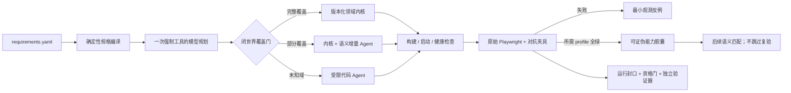

# Langqi Forge（琅岐铸造）

Factory26 / ARC-Bench 参赛 Harness：用一次真实模型工具调用把需求编译成可验证的构建契约，再用版本化能力内核或受限代码 Agent 产生可运行软件。

Langqi Forge 的目标不是“再包一层 Claude Code”，而是让软件工厂真正会积累经验：

```text
公开黑盒失败 → 最小反例 → 定点修复
                           ↓
公开基准 + 对抗复验全绿 → 可证伪能力胶囊 → 后续需求语义匹配
                                                        ↓
                                              仍然必须完整复验
```

换句话说，它复用的不是一个项目名或模板路径，而是“哪些行为条款已被哪些黑盒证据验证过”。旧胶囊只能影响路由，不能跳过新制品的构建、启动、GUI 和对抗验收。

## 当前证据状态

证据分两层，不混为一谈：

| 层级 | 状态 | 能证明什么 |
|---|---|---|
| 2026-08-31 历史生产基线 | 真实调用阿里云百炼 `qwen-plus`；GitHub 101/101 + 改名对抗 101/101 + Spreadsheet 102/102 | 旧提交 `c93949a`在固定公开题上 304/304；见 [`evidence/final/`](evidence/final/README.md) |
| 当前 v2 强化候选 | Python 112/112、Node 22/22；最新双域 dry-run 制品仍为 304/304 | 新身份边界、并发事务、锁定 Prompt/测试清单/Playwright 运行时、环境隔离、轨迹防泄露、独立验证器和最小确定性比赛包通过本地回归 |
| v2 最终生产证据 | 待本次实现冻结后生成 | 必须从干净 commit 通过真实模型网关、三次顺序 GUI、v2 资格门和独立证据验证器 |

上述结果只适用于已锁定哈希的公开任务，不等于隐藏题必过、Top 20 或获奖保证。

- [历史真实百炼证据](evidence/final/README.md)
- [基线与演进记录](docs/BASELINE.md)
- [v2 对抗强化与故障语义](docs/HARDENING.md)
- [生产轨迹、Agent 迭代与人工点](docs/TRACE.md)
- [Harness 架构](docs/ARCHITECTURE.md)
- [评委 3 分钟阅读路径](docs/EVALUATOR_GUIDE.md)
- [Codex / Claude Code 盲测协议](benchmarks/README.md)

## 为什么它不是普通 Coding Agent

| 普通空白工作区 Agent | Langqi Forge |
|---|---|
| 每次重新理解并重写整个产品 | 先做闭世界能力覆盖证明，只把未覆盖的语义增量交给代码 Agent |
| 模型说“完成了”便进入下一步 | 强制 `select_build_contract` 函数工具；错选、拒答或参数漂移都关闭资格门 |
| 测试失败是一大段日志 | 失败按根因聚类为最小观测反例，并绑定测试包、应用源码和原始 Playwright 报告 |
| “以前做过”是不可证伪的记忆 | 胶囊锁定能力版本、行为条款、排除项、源码 SHA 与基准/对抗证据 |
| 证据由生成者自述 | 运行封口把 Prompt、tool call、源码、GUI 和胶囊交叉绑定；独立 CLI 重演脱敏并重算资格规则 |

## Agent 是真实执行者，不是装饰

正式路径必须完成一次 OpenAI-compatible 模型调用。Planner 会收到紧凑的需求摘要、闭世界能力合同和不可用能力列表，并被强制调用：

```text
select_build_contract(
  domain,
  kernel_eligible,
  capability_tags,
  risks,
  validation_focus,
  rationale,
  uncovered_requirement_ids
)
```

只有当模型选择的领域与规格编译器一致、版本化能力完整覆盖需求且原始 tool 参数被完整留存并可重演，内核路由才有资格通过。未知或新增能力只把对应需求节点交给受限代码 Agent；模型异常时可为了可用性生成既有内核，但不能通过发布门。

为同时优化 Token 与墙钟，Planner 只接收本地提出的候选域合同及其能力标签 schema，不接收本地覆盖结论；它仍可否决或退回 generic。另一领域的合同和标签不会重复进入上下文。模型请求在途时，Harness 并行物化可回滚基座并做构建/健康预检；只有没有后续代码修改时，预检才会晋级为最终本地检查，不能绕过 Planner 或 GUI 门。

这意味着模型是控制面，版本化能力是数据面；它不要求模型每次花数万 Token 重写已被验证的部分。

## 双域可运行产品

公开题并非静态 UI 复制。同一生成制品包含可执行的企业闭环：

- GitHub：随机服务端会话、PBKDF2 凭据、按身份裁剪读取、角色矩阵、字段白名单、Actions 出处绑定、Ruleset / CODEOWNERS / 职责分离和原子合并。
- Spreadsheet：安全公式、必填/唯一/引用约束、乐观 revision、整数分双借贷、不可变冲销、幂等记账、关账期和带提前期/损耗/安全库存的 BOM/MRP。
- 两域的持久化均为原子替换；坏 JSON、审计链断裂或业务状态根不一致时拒绝启动/写入，不会静默重置为空数据。

## 系统流程



## 平台启动

标准入口符合 ARC-Bench 运行合同：

```bash
python main.py <requirement_path> \
  --output-dir <generated_project> \
  --type web \
  --web-port 3000
```

平台注入 `OPENAI_API_KEY`、`OPENAI_BASE_URL`、`MODEL`、`ARCBENCH_TASK_DIR`、`ARCBENCH_TEMPLATE_DIR` 和 `ARCBENCH_WEB_PORT`。模型网关不被写死为百炼；官方比赛网关可以注入 Kimi、GLM、MiniMax 或 DeepSeek。自发布证据可额外锁定百炼/Qwen profile。

### 生成最小比赛包（不上传）

```bash
sh arc.sh pack
# 或
.venv/bin/python -m factory26_harness.submission_bundle \
  --output dist/langqi-forge-agent.zip
```

打包器只收录 `main.py`、运行依赖、Harness 运行模块和双域模板；测试、历史证据、文档、benchmark、缓存和凭据不会进入 zip。文件顺序、时间戳和压缩参数固定，同一提交可产生逐字节相同的包。它无例外拒绝脏工作树，并嵌入逐文件哈希与完整 Git revision；平台解压后即使没有 `.git/`，运行也会先检查源码与清单完全一致，再把声明的 revision 和清单哈希写入生产轨迹。解压包运行时，`--output-dir` 必须位于解压源码目录之外；若误放入包内，入口会在创建任何生成文件前拒绝，避免污染下一次源码验签。最终真实性仍由公开仓库 commit、上传快照和 zip SHA 的外部绑定共同证明。`arc.sh` 刻意没有登录、上传或提交命令。

生成结果的 `.arc/` 至少包含：

```text
.arc/
├── runner-events.jsonl
├── production-trace.jsonl
├── planner-contract.json
├── compiled-plan.json
├── capability-coverage.json
├── change-impact.json
├── harness-report.json
├── run-envelope.json
├── capability-capsule.json          # 只在所需 profile 全绿后出现
├── counterexamples/                 # 失败时出现
├── public-eval/                     # compact + 原始 Playwright 报告
└── traceability/
```

## 本地运行

```bash
python3 -m venv .venv
.venv/bin/pip install -r requirements.txt
.venv/bin/python -m unittest discover -s tests -v
node --test tests/*.test.mjs
```

使用任意 OpenAI-compatible 网关：

```bash
export OPENAI_API_KEY='your-key'
export OPENAI_BASE_URL='https://your-gateway.example/v1'
export MODEL='your-model'

.venv/bin/python main.py path/to/requirements \
  --output-dir /tmp/langqi-output \
  --web-port 3301 \
  --smoke-port 3302 \
  --strict-exit
```

阿里云百炼 OpenAI-compatible 路由：

```bash
export OPENAI_API_KEY="$DASHSCOPE_API_KEY"
export OPENAI_BASE_URL='https://dashscope.aliyuncs.com/compatible-mode/v1'
export MODEL='qwen-plus'
```

`--dry-run` 只用于离线检查规格、构建和启动；它跳过模型，不能通过正式资格门。

## 复现公开验收

公开题包只同步到本地 `.cache/`，不复制进参赛仓库：

```bash
.venv/bin/python -m factory26_harness.public_tasks github sheet

.venv/bin/python -m factory26_harness.public_eval github /tmp/langqi-github \
  --port 3401 --workers 4 --strict-exit

.venv/bin/python -m factory26_harness.public_eval github /tmp/langqi-github \
  --port 3411 --workers 4 --fixture-profile adversarial --strict-exit

.venv/bin/python -m factory26_harness.public_eval sheet /tmp/langqi-sheet \
  --port 3421 --workers 4 --strict-exit
```

评测 label 是不可覆盖的，防止“失败后原地重跑，只保留最好结果”。每次 GUI 都绑定原始 Playwright JSON、逐项测试 inventory、固定测试包 SHA、需求 SHA、应用源码 SHA、生成 run id 和 Playwright 1.62.1 完整运行时树。只写 `expected=101/102` 而没有枚举原始测试的伪报告无法通过。评测子进程使用环境白名单，不继承模型/云密钥或宿主 `NODE_OPTIONS`。

官方网关中立资格门：

```bash
.venv/bin/python -m factory26_harness.qualification \
  --github-project /tmp/langqi-github \
  --sheet-project /tmp/langqi-sheet \
  --output /tmp/qualification.json
```

自发布的百炼证据则锁定 host、provider provenance 和 Qwen allowlist：

```bash
.venv/bin/python -m factory26_harness.qualification \
  --github-project /tmp/langqi-github \
  --sheet-project /tmp/langqi-sheet \
  --bailian-evidence-profile \
  --output /tmp/qualification.json
```

证据导出前会再次重算资格门；输出目录必须是新建或空目录：

```bash
.venv/bin/python -m factory26_harness.evidence \
  --github-project /tmp/langqi-github \
  --sheet-project /tmp/langqi-sheet \
  --qualification /tmp/qualification.json \
  --output-dir /tmp/langqi-evidence

.venv/bin/python -m factory26_harness.verify_evidence /tmp/langqi-evidence
```

独立验证器会检查精确文件集、SHA/size、封口轨迹、模型请求/回复/tool-call 事件、三次固定 GUI、胶囊语义、脱敏轨迹的确定性重演，并独立重算资格检查。

## 评委一页入口

为了让评委不必先阅读整个仓库，可从已封口的双域制品生成一份自包含 HTML 和同源 JSON：

```bash
.venv/bin/python -m factory26_harness.judge_report \
  --github-project /tmp/langqi-github \
  --sheet-project /tmp/langqi-sheet \
  --qualification /tmp/qualification.json \
  --output /tmp/langqi-judge/index.html \
  --data-output /tmp/langqi-judge/index.json
```

报告会先重验运行封口、轨迹和能力胶囊，然后展示需求数、模型使用、Agent 轮次、人工干预、三套 GUI 和封口事件。未提供或未通过资格文件时，页面不会冒充“已合格”；dry-run 只显示 `LOCAL CANDIDATE`。输出文件已存在时拒绝覆盖，避免用新报告洗掉旧结果。

## 安全与声明边界

- 模型只能通过白名单工具写 `frontend/` 与 `backend/`，不能修改 `.arc/`、Git、评分器或工作区外文件。
- 需求文本按不可信数据处理；未知/恶意要求不能继承相邻节点的内核覆盖。
- 稳定领域合格路径限 1 次模型请求和 1 次 HTTP 尝试；Planner 不重试，失败会显式降级并关闭发布资格。
- 精确轨迹用于本地交叉绑定；公开链接应指向可验证的脱敏轨迹。密钥从不写入任何轨迹。
- 本地健康检查不等于 GUI 得分；公开 GUI 全绿也不等于隐藏测试或最终排名。
- 证据包能证明内部自洽和篡改可检测，不能单独证明第三方硬件计量；正式 Token/时间以比赛平台为外部权威。

## 来源

项目从 `octos-org/arc-adapter` 的平台合同出发，保留 `arcbench_agent_runtime/` 协议层；规格编译、Planner、受限 Agent、双域内核、公开评测、对抗夹具、反例/胶囊和证据门均在本仓库独立实现。上游参考提交：`b0999c95f7875c8d4ff3e58e733fb2c5abc8caf7`。
