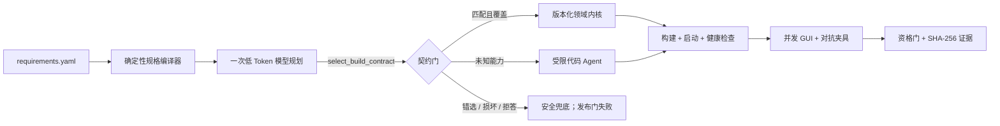

# Langqi Forge（琅岐铸造）

Factory26 / ARC-Bench 参赛 Harness：让一个低 Token 规格规划 Agent 选择可验证的构建契约，再由版本化能力内核或受限代码 Agent 生成可运行软件。

它不是“零 Token 模板脚本”。正式路径必须完成一次真实 OpenAI-compatible 模型调用，并由模型通过 `select_build_contract` 函数工具明确给出领域、能力覆盖、风险和验证重点。模型选错、拒答、返回损坏参数或没有真正调用工具时，软件可以安全降级生成，但发布资格门会失败。

## 已验证结果

2026-08-31 使用阿里云百炼 `qwen-plus` 的真实独立运行：

| 制品 / 世界 | 模型请求 | prompt / completion Token | GUI | unexpected / skipped / flaky | GUI 时间 |
|---|---:|---:|---:|---:|---:|
| GitHub 基准 | 1 | 2776 / 280 | 101 / 101 | 0 / 0 / 0 | 9.123 秒 |
| GitHub 对抗改名 | 同一制品 | 同上 | 101 / 101 | 0 / 0 / 0 | 8.687 秒 |
| Spreadsheet 基准 | 1 | 1756 / 271 | 102 / 102 | 0 / 0 / 0 | 17.073 秒 |

三次 GUI 验收均为 4 workers、文件内完全并发。GitHub 与 Spreadsheet 的生成、构建、启动、健康检查、完整轨迹和 fail-closed 资格门全部通过。GUI 时间会受本机并发负载影响；这组结果只证明固定公开需求哈希，不保证隐藏测试、Top 20 或获奖。

- [完整公开生产轨迹](evidence/final/README.md)
- [基线、对抗与演进记录](docs/BASELINE.md)
- [最新对抗强化与故障注入记录](docs/HARDENING.md)
- [轨迹字段与人工干预边界](docs/TRACE.md)
- [Harness 架构与失败语义](docs/ARCHITECTURE.md)

## 不止复刻：可执行的企业闭环

公开题内核保持 GitHub 101 项与 Spreadsheet 102 项兼容；同一生成制品还包含两条不是静态页面的企业闭环：

- GitHub：Actions 作业结果写入带来源的 PR checks，活跃 Ruleset 联合审批、CODEOWNERS、状态检查和职责分离做服务端判定；通用 `patch` 不能伪造合并，也不能直写受保护分支；合法合并原子更新目标分支、提交和审计状态根。
- Spreadsheet：运行时 Schema 支持必填、唯一、引用与安全公式；总账使用整数分、借贷平衡、不可变冲销、幂等重试和关账期；BOM/MRP 支持环检测、提前期、批量、安全库存、损耗、日期化到货与需求追溯。
- 两域的证据事件同时绑定前一事件哈希和完整业务状态根；链或业务状态任一被篡改，后续写入都会 fail closed。损坏的持久化文件不会被“恢复”为一份空数据。

这些扩展的最新本地证据与正式百炼证据分开记录，避免把 dry-run 冒充模型生产运行。详见 `docs/HARDENING.md`。

## Harness 如何工作



模型是控制面，不承担已经稳定、可测试能力的重复手写；领域内核是数据面，负责低时延、高确定性的执行。当前内核覆盖 GitHub 与 Spreadsheet；未知领域会进入带文件范围、工具白名单、轮数预算和停滞熔断的代码 Agent。

这个模型调用不是装饰：只有模型选择的领域与规格编译器一致、声明内核可覆盖，并实际调用规定函数工具，最终资格门才会通过。最终轨迹保留完整 system/user Prompt、模型原始工具调用、响应 ID、Token、Agent 迭代、执行工具和人工干预检查点。

## 平台启动方式

标准入口符合 ARC-Bench 合同：

```bash
python main.py <requirement_path> \
  --output-dir <generated_project> \
  --type web \
  --web-port 3000
```

平台负责注入：

- `OPENAI_API_KEY`
- `OPENAI_BASE_URL`
- `MODEL`
- `ARCBENCH_TASK_DIR`
- `ARCBENCH_TEMPLATE_DIR`
- `ARCBENCH_WEB_PORT`

生成结果固定包含：

```text
generated_project/
├── frontend/                         # npm install && npm run build
├── backend/                          # PORT=... npm start
└── .arc/
    ├── runner-events.jsonl
    ├── production-trace.jsonl        # 完整 Prompt / 工具 / 迭代 / 人工点
    ├── planner-contract.json
    ├── compiled-plan.json
    ├── change-impact.json
    ├── harness-report.json
    └── traceability/
```

## 本地运行

```bash
python3 -m venv .venv
.venv/bin/pip install -r requirements.txt
.venv/bin/python -m unittest discover -s tests -v
```

使用任意 OpenAI-compatible 网关：

```bash
export OPENAI_API_KEY='your-key'
export OPENAI_BASE_URL='https://your-gateway.example/v1'
export MODEL='your-model'

.venv/bin/python main.py path/to/requirements \
  --output-dir /tmp/langqi-output \
  --web-port 3301 \
  --smoke-port 3302 \
  --strict-exit
```

阿里云百炼可使用其[官方 OpenAI 兼容接口](https://help.aliyun.com/zh/model-studio/compatibility-of-openai-with-dashscope)：

```bash
export OPENAI_API_KEY="$DASHSCOPE_API_KEY"
export OPENAI_BASE_URL='https://dashscope.aliyuncs.com/compatible-mode/v1'
export MODEL='qwen-plus'
```

`--dry-run` 只用于离线检查结构、构建和启动；它明确跳过模型，不能通过正式资格门，也不能冒充参赛生产轨迹。

## 复现公开验收

公开题包只在本地同步，源码不会复制进参赛仓库：

```bash
.venv/bin/python -m factory26_harness.public_tasks github sheet
```

生成制品后运行完整 GUI：

```bash
.venv/bin/python -m factory26_harness.public_eval github /tmp/langqi-github \
  --port 3401 --workers 4 --strict-exit

.venv/bin/python -m factory26_harness.public_eval github /tmp/langqi-github \
  --port 3411 --workers 4 --fixture-profile adversarial --strict-exit

.venv/bin/python -m factory26_harness.public_eval sheet /tmp/langqi-sheet \
  --port 3421 --workers 4 --strict-exit
```

最后执行独立发布门：

```bash
.venv/bin/python -m factory26_harness.qualification \
  --github-project /tmp/langqi-github \
  --sheet-project /tmp/langqi-sheet \
  --output qualification.json
```

门禁会拒绝模型未调用、非工具决策、错选执行路线、轨迹缺失、Token 越界、需求哈希漂移、构建失败、少于 4 workers、测试过滤、计数漂移、unexpected、skipped、flaky、非全并发或超时。

## 安全与声明边界

- 模型只能通过白名单工具写 `frontend/` 与 `backend/`，不能改 `.arc/`、Git、评分器或仓库外文件。
- 需求标题与描述按不可信数据处理，不能覆盖 Planner 的系统指令。
- 每次模型请求、HTTP 重试和 Token 都记账；稳定领域发布路径限一次成功请求。
- 失败时保留可运行内核是可用性策略，不等于发布成功；资格门仍 fail closed。
- 本地健康检查不等于 GUI 得分，公开 GUI 全绿也不等于隐藏测试或最终排名。
- 生产轨迹在公开前移除本机绝对路径，不移除 Prompt、模型回复或工具参数；密钥从不写入轨迹。

## 来源

项目从 `octos-org/arc-adapter` 的平台合同出发，保留其 `arcbench_agent_runtime/` 协议层；规格规划、代码 Agent、领域内核、公开评测、对抗夹具与资格门均在此仓库独立实现。上游参考提交：`b0999c95f7875c8d4ff3e58e733fb2c5abc8caf7`。
